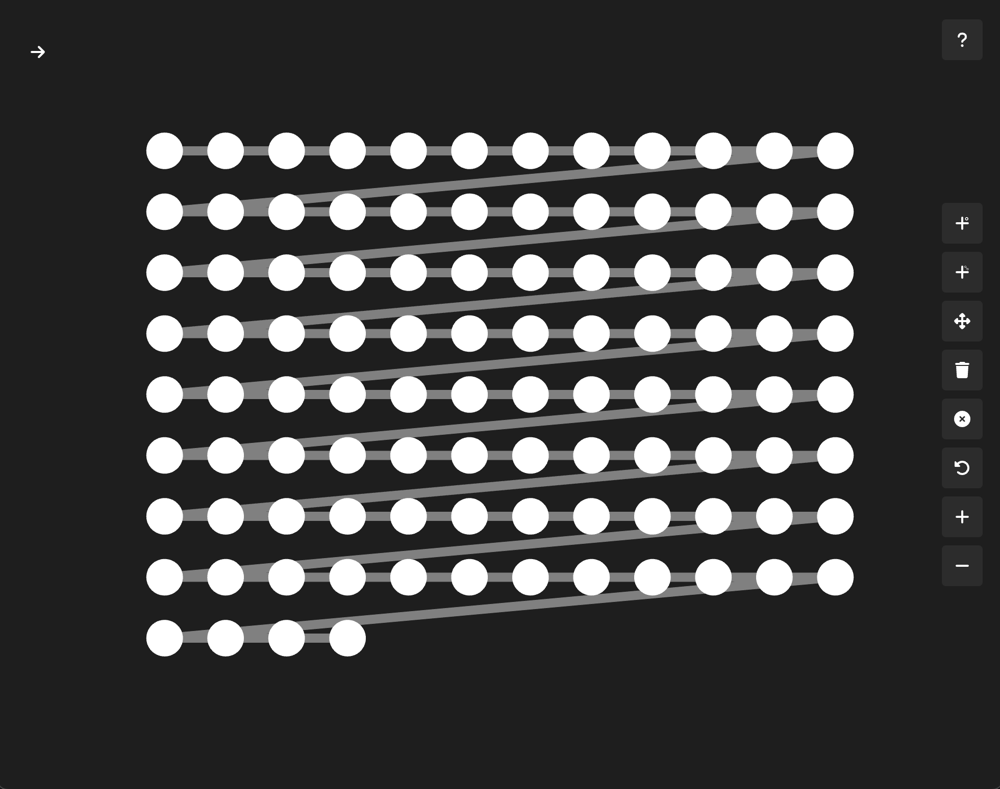

# Graph Editor Template

This repository is a starter template for web-based graph editor applications.

Use the `Use this template` button to create a repository using this one as a starting point.

**If you use this in your own project**, please link to or credit this repository. This code is open-source, so you are not required to, but it would be kind.

### Motivation

Web apps that utilize graph editors are often complex and very custom software. To accommodate these usecases, this repository serves as a starting point for a full codebase, rather than a library that solves every problem.

This starter code was originally created to serve as a starting point for a personal project, but I figured others may want a solid starting point like this one.

### Dependencies

This codebase is built with TypeScript and Vite, and is tested with Vitest. If you prefer using different build tools, feel free to switch, and if possible, contribute some kind of guide on how to do it.

### Contribution

There are many potential improvements to this codebase. I have listed some in the [Progress Tracker](#progress-tracker) section.

If you would like to contribute a feature or improvement, please create a PR to share your improvements.

If there is a problem with the base code, open an issue.

**A couple of details about contributing:** Not all changes to the codebase are beneficial. If your feature or improvement fixes a problem, or extends the functionality of the code in a beneficial way, that's helpful.

However, if your code is a customization for a usecase you prefer, but could restrict the possible usecases of the codebase for others, it would be better to keep this in your own codebase.

_I am open to creating a theme system, or to listing unofficial themes in this repo, but I haven't done any work towards this end._

_If you aren't sure if a feature would be helpful, but you want to share the idea, open an issue._

## Benchmarks

The system has been tested on an M2 MacBook Air, using the FPS counter in the rendering tab of Chrome DevTools. **These tests were performed before some optimizations, so they may be slightly underestimating performance**

#### Fully Connected (every node to every other node)

10 Nodes: 60 fps static, 60 fps moving
50 Nodes: 60 fps static, 60 fps moving
100 Nodes: 60 fps static, at min 20 fps moving

### Sparsely Connected (one edge per node)

10 Nodes: 60 fps static, 60 fps moving
50 Nodes: 60 fps static, 60 fps moving
100 Nodes: 60 fps static, 60 fps moving
500 Nodes: 60 fps static, 60 fps moving
1000 Nodes: 60 fps static, 60 fps moving
5000 Nodes: 60 fps static, 50 fps moving
10000 Nodes: 45 fps static, 35 fps moving
50000 Nodes: 15 fps static, 12 fps moving

## Progress Tracker

-   [x] Create basic graph nodes and edges
-   [x] Add mock event listeners using offscreen canvas (are there fractional colors?)
-   [x] Create mouse zoom system (offset, dpr initial scale, center origin)
-   [x] Add graph editing keyboard shortcuts
    -   [x] Move point
    -   [x] Remove point
    -   [x] Add point
    -   [x] Add edge
    -   [x] Remove edge
    -   [x] Deselect
    -   [x] Undo (make each thing an action, and then make classes with an undo method, and a stack (w/ generics) for history)
    -   [ ] Improve add node/edge icons
-   [x] Add any tests that may be useful
-   [x] Create global configuration system
-   [x] Create tooltip/info card that shows shortcuts on hover (synchronized with code)
-   [x] Add config/content pane on the left side (like streamlit)
-   [x] Benchmark/profile the system on large datasets
-   [x] Automatically center and scale based on dataset x and y coords
-   [x] Add zoom buttons
-   [x] Improve class reusability, like with buttons
-   [x] Split up css files
-   [x] Add accessibility features
-   [x] Make reusable graph generator
-   [x] Prepare README for initial release
-   [x] Change action names to be based on actions and not names of things (info-button-active => show-shortcut-info)
-   [ ] Add CSS theme system
-   [ ] Automatically move graph when showing the info/config panel
-   [ ] Interchangeable 2d and webgl renderers
-   [ ] Find performance improvements (try doing stroke and fill only once for nodes and edges)
-   [ ] Create cleaning command to remove testing files for new repos
-   [ ] Add additional offscreen canvas for edges only to increase scalability
-   [ ] Add wraparound handling for items outside the range
-   [ ] Make sure the color system works beyond 256^3

